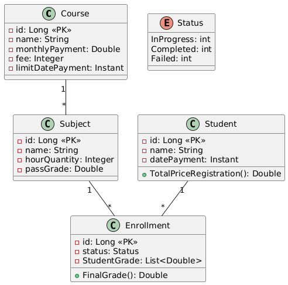

#  System Academic

Sistema de gerenciamento acadêmico desenvolvido com **Spring Boot** e **Java 21**, estruturado com boas práticas de arquitetura (camadas de controller, service, repository). O sistema permite o cadastro de professores, alunos, 
cursos e disciplinas, além da matrícula de alunos em disciplinas. Todos os endpoints são RESTful.

>  Atualmente, o projeto está feito e deploy em produção.

---

##  Tecnologias utilizadas

- Java 21
- Spring Boot 3.5.3
- Spring Web
- Spring Data JPA
- PostgreSQL (produção)
- H2 (testes locais)
- Maven
- Docker(usado apenas para especificar ambiente Java no Render)
- Render

---

##  Funcionalidades

- [x] CRUD de cursos
- [x] CRUD de professores
- [x] CRUD de alunos
- [x] CRUD de disciplinas
- [x] Matrícula de alunos em disciplinas
- [x] Endpoints REST
- [x] Persistência com JPA/HIBERNATE
- [x] Banco de dados relacional (H2/PostgreSQL)
- [x] Deploy em produção *(feito)*

---

##  Arquitetura do Projeto
```
System-Academic/
├── src/
│   ├── main/
│   │   ├── java/
│   │   │   └── com.dev.System_Academic/
│   │   │       ├── Config
│   │   │       ├── Entities
│   │   │       ├── Entities.Enum
│   │   │       ├── Repositories
│   │   │       ├── Resources/
│   │   │       ├── Resources.Exception
│   │   │       ├── Services/
│   │   │       └── Services.Exception/
│   └── resources/
│       └── application.properties
├── Dockerfile
├── render.yaml
├── pom.xml
```

## Diagrama UML - fluxo do sistema 


## Sobre o uso do Docker

A aplicação foi preparada com um Dockerfile com o único objetivo de permitir o deploy no Render.com, já que a plataforma não oferece suporte nativo ao Java. O Dockerfile especifica a versão do Java (Eclipse Temurin 21) e empacota a aplicação.

 Observações Finais 
 
    Ainda não utilizo Swagger para documentação da API 
    O foco principal foi aplicar na prática os conhecimentos de Spring Boot, Java moderno, JPA e PostgreSQL  

